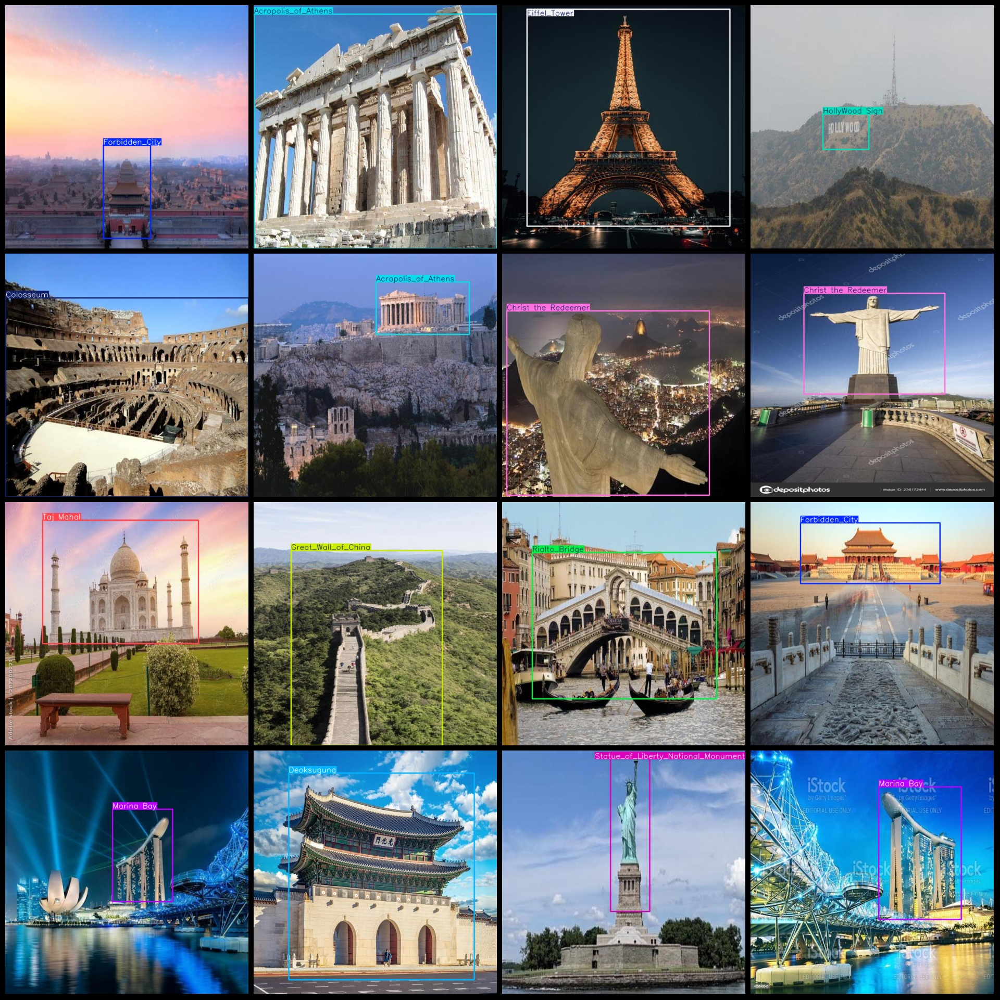
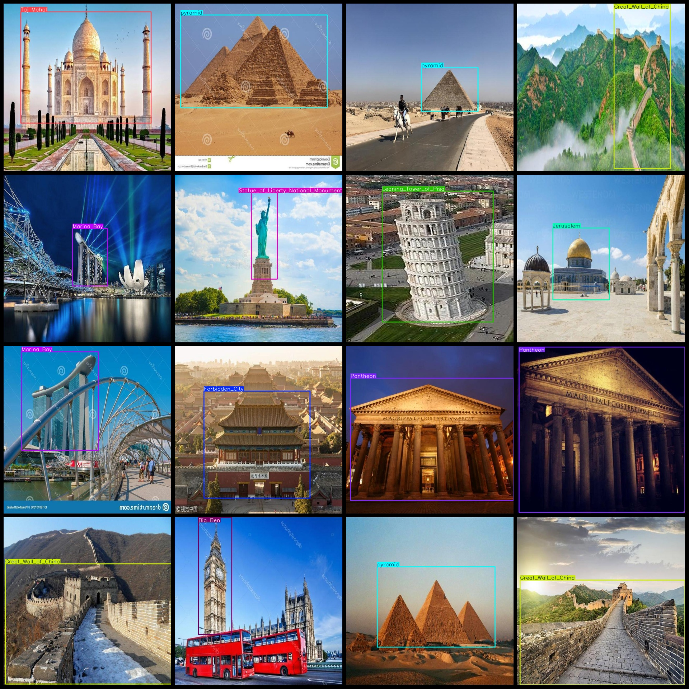

# World Famous Landmarks, Historical Relics, Modern Buildings, and Natural Landscape Detection Dataset VOC+YOLO Format with 727 Images and 25 Categories

Dataset format: Pascal VOC format + YOLO format (txt files without split paths, only containing jpg images and corresponding VOC format xml files and yolo format txt files)
Number of images (jpg file count): 727
Number of annotations (xml file count): 727
Number of annotations (txt file count): 727
Number of annotation categories: 25
Annotation category names (note that the order in yolo format is not consistent with this, but refer to the labels folder classes.txt): ["Acropolis_of_Athens", "Arc de Triomphe", "Big_Ben", "BlueMosque", "Brandenburg_Gate", "CN_Tower", "Casa_Mila", "Christ the Redeemer", "Colosseum", "Deoksugung", "Eiffel_Tower", "Forbidden_City", "Gardens_by_the_Bay", "Great_Wall_of_China", "HollyWood Sign", "Jerusalem", "Leaning_Tower_of_Pisa", "London_Eye", "Marina Bay", "Opera_House", "Pantheon", "Rialto_Bridge", "Statue_of_Liberty_National_Monument", "Taj Mahal", "pyramid"]
Number of boxes per category:
- Acropolis_of_Athens (Athens Tower) boxes = 32, occupied images = 32
- Arc de Triomphe (Triumphal Arch) boxes = 26, occupied images = 26
- Big_Ben (Big Ben) boxes = 30, occupied images = 30
- BlueMosque (Blue Mosque) boxes = 29, occupied images = 29
- Brandenburg_Gate (Brandenburg Gate) boxes = 29, occupied images = 29
- CN_Tower (Canadian National Tower) boxes = 29, occupied images = 29
- Casa_Mila (Phoenix House) boxes = 25, occupied images = 25
- Christ the Redeemer (Christ the Redeemer) boxes = 37, occupied images = 37
Colosseum frame count = 33, image count = 33
Deoksugung frame count = 17, image count = 17
Eiffel Tower frame count = 30, image count = 30
Forbidden City frame count = 29, image count = 29
Gardens by the Bay frame count = 23, image count = 23
Great Wall of China frame count = 33, image count = 33
HollyWood Sign frame count = 31, image count = 31
Jerusalem frame count = 32, image count = 32
Leaning Tower of Pisa frame count = 34, image count = 34
London Eye frame count = 21, image count = 21
Marina Bay frame count = 28, image count = 28
Opera House frame count = 35, image count = 35
Pantheon frame count = 26, image count = 26
Rialto Bridge frame count = 30, image count = 30
Statue of Liberty National Monument frame count = 31, image count = 31
Taj Mahalbox count = 26，images = 26
pyramidbox count = 37，images = 31
total boxes: 733  
image resolution: 640x640  
Using annotation tool: labelImg.
Annotation rules: draw a rectangle around the class.
Important notes: The dataset does not have separate training, validation, and test sets. Please split them yourself.
Special statement: This dataset does not guarantee the accuracy of the trained model or the weights file.
Image preview:
## Images

Here is a pay link on Stripe ( https://buy.stripe.com/3cs8yP7sY87d0vu9AB ). Please contact me lonlonago@foxmail.com after funding $89, and I will send you a complete data files , thank you!

